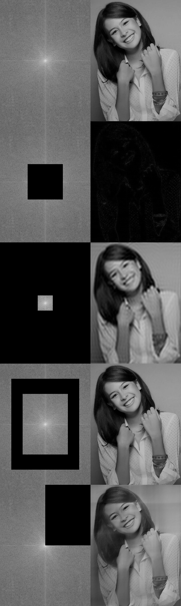
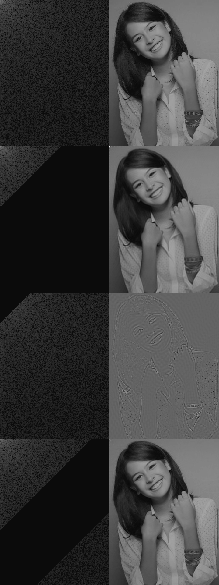

# Fourier Transform & Cosine Transform on Image

## Fourier Transform

Original, Low Pass, High Pass, Inverse Band Pass, North East Pass

## Cosine Transform

Original, Low Pass, High Pass, Inverse Band Pass

